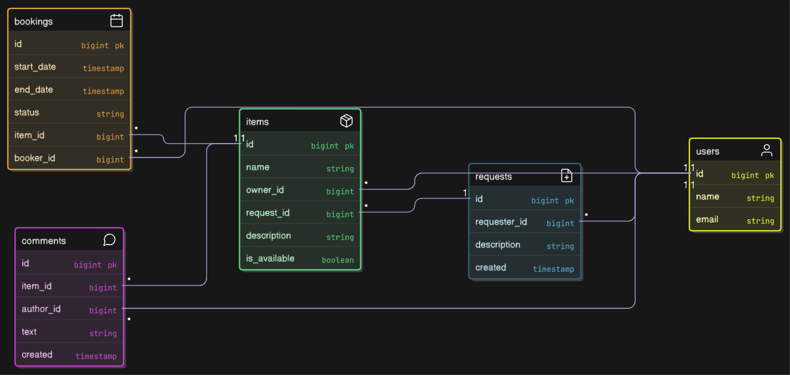

# java-shareit — это платформа для обмена вещами или ресурсами, где :
- Пользователи могут публиковать свои вещи,
- Пользователи могут запрашивать вещи,
- А владельцы вещей могут их предоставлять в аренду или пользование.

## Схема БД


<details>
  <summary>Код схемы БД</summary>

```
Table users {
  id BIGINT [primary key, increment]
  name VARCHAR(255) [not null]
  email VARCHAR(255) [not null, unique]
}

Table requests {
  id BIGINT [primary key, increment]
  description VARCHAR(255) [not null]
  requester_id BIGINT [not null]
  created TIMESTAMP [not null]
}

Table items {
  id BIGINT [primary key, increment]
  name VARCHAR(255) [not null]
  description VARCHAR(255) [not null]
  is_available BOOLEAN [not null, default: true]
  owner_id BIGINT [not null]
  request_id BIGINT
}

Table bookings {
  id BIGINT [primary key, increment]
  start_date TIMESTAMP [not null]
  end_date TIMESTAMP [not null]
  item_id BIGINT [not null]
  booker_id BIGINT [not null]
  status VARCHAR(64)
}

Table comments {
  id BIGINT [primary key, increment]
  text VARCHAR(2048) [not null]
  item_id BIGINT [not null]
  author_id BIGINT [not null]
  created TIMESTAMP
}

// Определение связей между таблицами
Ref: requests.requester_id > users.id
Ref: items.owner_id > users.id
Ref: items.request_id > requests.id
Ref: bookings.item_id > items.id
Ref: bookings.booker_id > users.id
Ref: comments.item_id > items.id
Ref: comments.author_id > users.id

```
</details>
<details>

  <summary>Описание схемы БД</summary>

### Эта схема представляет собой диаграмму базы данных, описывающую структуру данных для системы, связанной с арендой и управлением ресурсами.
+ users: Содержит информацию о пользователях системы (id, имя, email). email - уникальный, то есть не может быть двух пользователей с одинаковым email.
+ requests: Отражает запросы пользователей (id, описание, id пользователя, создавшего запрос, и дата создания запроса).
+ items:  Представляет доступные для аренды/использования объекты (id, имя, описание, статус доступности, id владельца, id запроса, связанного с созданием этого объекта).
+ bookings:  Содержит информацию о бронированиях объектов (id, даты начала и окончания бронирования, id объекта, id пользователя, забронировавшего объект, и статус бронирования).
+ comments:  Содержит комментарии к объектам (id, текст комментария, id объекта, к которому относится комментарий, id автора комментария и дата создания комментария).

+ Ref: Описывают внешние ключи и связи между таблицами.
  Например, requests.requester_id > users.id означает, что столбец requester_id в таблице requests является внешним ключом,
  ссылающимся на столбец id в таблице users. Это обеспечивает целостность данных и позволяет связывать запросы с конкретными пользователями.
  Другие связи аналогично соединяют пользователей, объекты, бронирования и комментарии.
</details>